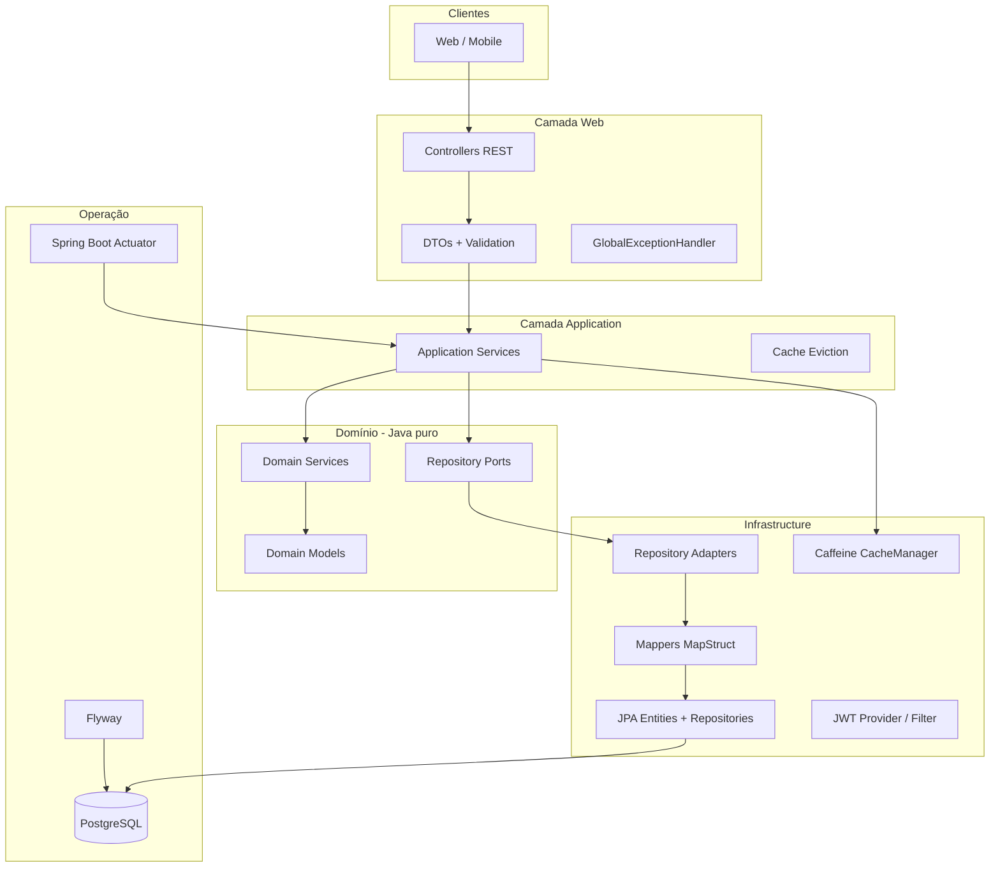

# Arquitetura

> Valores canónicos (stack, URLs, JWT): [CONVENCOES.md](CONVENCOES.md)

## Estilo

**Camadas + domínio rico (pragmático):** regras de negócio testáveis fora dos controllers; persistência e frameworks isolados em `infrastructure`.

## Diagrama de camadas (Plano v2)



## Fluxo de uma requisição autenticada

1. Cliente envia `Authorization: Bearer <accessToken>`.
2. `JwtAuthenticationFilter` valida o token e popula o contexto de segurança.
3. Controller recebe DTO, valida com Bean Validation.
4. Application Service orquestra: regras de domínio, ports de repositório, transação `@Transactional`.
5. Adapter converte domínio ↔ JPA, persiste via Spring Data.
6. Resposta mapeada para DTO de saída (sem dados sensíveis).

## Decisões arquiteturais

| Decisão | Escolha | Motivo |
|---------|---------|--------|
| API | REST stateless | Simplicidade com JWT |
| Segurança | Spring Security 6 + JWT (access + refresh) | Stack acordada |
| Persistência | Spring Data JPA + Flyway | Migrações versionadas; `ddl-auto: validate` |
| Domínio | POJOs sem JPA | Testabilidade e clareza |
| Mapeamento | MapStruct | Reduz boilerplate entre domínio e JPA |
| Transações | `@Transactional` nos application services | Transferências atómicas |
| Isolamento | `userId` em todas as queries de negócio | Evitar IDOR |
| Erros | `@ControllerAdvice` + RFC 7807 | Respostas consistentes |
| Relatórios | Queries em infra + cache Caffeine | Performance |
| Deploy | Docker Compose (app + postgres) | Stack acordada |
| Testes | JUnit 5 + Testcontainers | Integração realista com PostgreSQL |

## Pacotes lógicos

```
com.financas.api
├── config              # Security, JWT, OpenAPI, Cache, JpaAuditing, Actuator
├── web                 # Controllers, DTOs, mappers web, exceptions
├── application         # Services, orquestração, @CacheEvict
├── domain              # Models, enums, ports, domain services
└── infrastructure      # JPA, adapters, JWT impl, cache config
```

## Plano v1 vs Plano v2

| Aspeto | Plano v1 | Plano v2 (alvo) |
|--------|----------|-----------------|
| Transferência | 2× `Transaction` + `transferPairId` | Entidade `Transfer` + 2 `Transaction` ligadas |
| JPA | Pode viver em `domain/model` | `*JpaEntity` só em `infrastructure` |
| Auditoria | Manual em `User` | `BaseJpaEntity` + `AuditableDomain` |
| Relatórios | Query em cada request | `@Cacheable` + Caffeine |
| Observabilidade | Não definida | Actuator (health, metrics, caches) |
| Mapeamento | Opcional manual | MapStruct recomendado |

## Dependências Maven (referência)

- `spring-boot-starter-web`
- `spring-boot-starter-data-jpa`
- `spring-boot-starter-security`
- `spring-boot-starter-validation`
- `spring-boot-starter-cache`
- `spring-boot-starter-actuator`
- `postgresql`, `flyway-core`, `flyway-database-postgresql`
- `jjwt-api`, `jjwt-impl`, `jjwt-jackson`
- `mapstruct`, `lombok` (opcional)
- `caffeine` (via spring-boot-starter-cache)
- Testes: `spring-boot-starter-test`, `testcontainers`, `spring-security-test`

## Princípios

1. **Domínio não depende de Spring nem JPA.**
2. **Controllers finos** — sem regra de negócio.
3. **userId sempre do token**, nunca confiar no body para autorização.
4. **Valores monetários** com `BigDecimal` e `NUMERIC` no PostgreSQL.
5. **Invalidar cache** em qualquer write que afecte relatórios.
