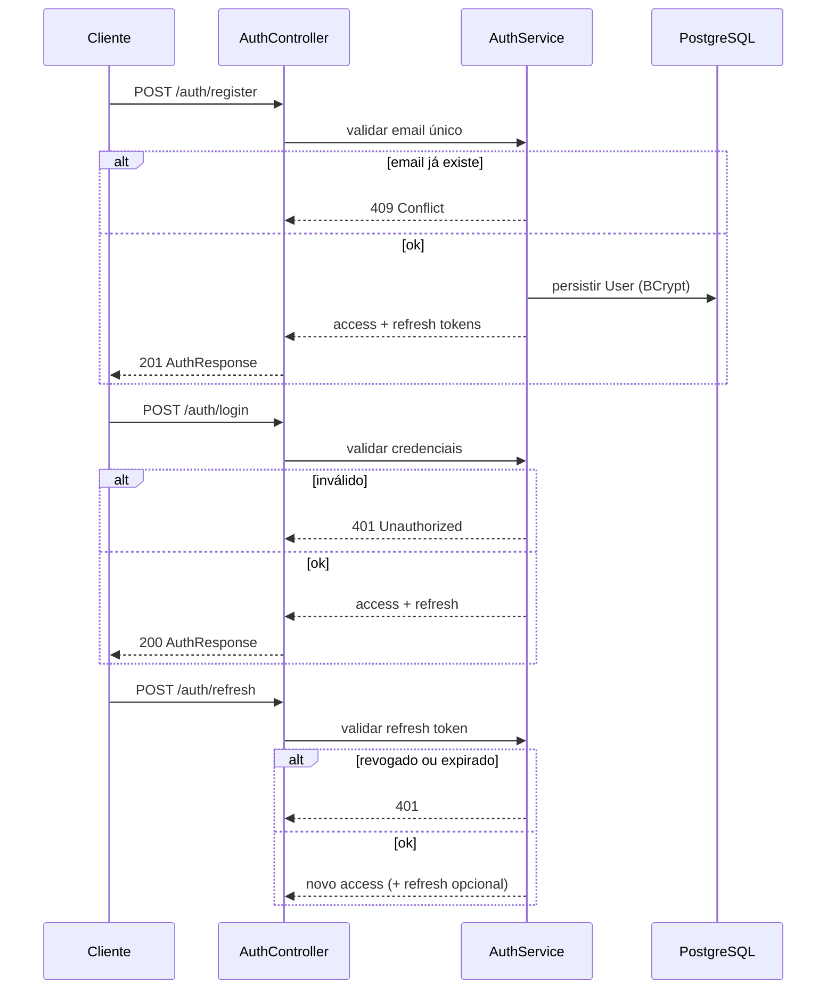
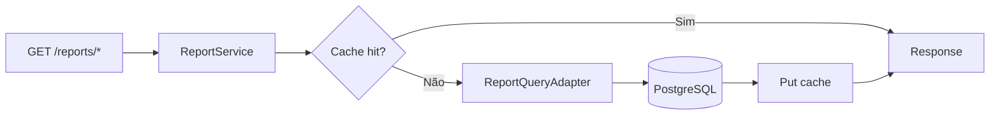

# Fluxo de regras de negócio

Todos os fluxos assumem **utilizador autenticado**, excepto rotas `/auth/**`.

Regra transversal em **todos** os application services:

```
entity.userId == currentUser.getId()
```

Repositórios devem expor `findByIdAndUserId(id, userId)` para evitar IDOR.

---

## 1. Autenticação



| Regra | Detalhe |
|-------|---------|
| Email único | Rejeitar registo duplicado (409) |
| Password | BCrypt antes de persistir |
| Rotas públicas | `/auth/register`, `/auth/login`, `/auth/refresh` |
| Demais rotas | `Authorization: Bearer <accessToken>` |
| Logout | Revogar refresh token (`revoked = true`) |

---

## 2. Criar transação (receita/despesa)

```mermaid
flowchart TD
    A[CreateTransactionRequest] --> B{JWT válido?}
    B -->|Não| Z[401]
    B -->|Sim| C{Conta existe e pertence ao user?}
    C -->|Não| Y[404]
    C -->|Sim| D{Conta activa?}
    D -->|Não| X1[422 Conta inactiva]
    D -->|Sim| E{Categoria existe e é do user ou sistema?}
    E -->|Não| Y2[404]
    E -->|Sim| F{Tipo compatível com kind?}
    F -->|EXPENSE + INCOME kind| X2[400]
    F -->|INCOME + EXPENSE kind| X2
    F -->|OK| G{amount > 0?}
    G -->|Não| X3[400]
    G -->|Sim| H[Persistir Transaction]
    H --> I[@CacheEvict relatórios]
    I --> J{Despesa com orçamento activo?}
    J -->|Sim| K[Calcular exceeded]
    K --> L[201 + opcional X-Budget-Warning]
    J -->|Não| M[201 TransactionResponse]
```

| Regra | Detalhe |
|-------|---------|
| INCOME | Categoria `CategoryKind.INCOME` |
| EXPENSE | Categoria `CategoryKind.EXPENSE` |
| userId | Sempre do token; ignorar userId no body |
| transferId | Null em transações manuais |
| Orçamento | Ver secção 4 |

---

## 3. Transferência entre contas

```mermaid
flowchart TD
    A[CreateTransferRequest] --> B{JWT válido?}
    B -->|Não| Z[401]
    B -->|Sim| C{fromAccountId != toAccountId?}
    C -->|Não| E1[400]
    C -->|Sim| D{Ambas contas do user e activas?}
    D -->|Não| E2[404]
    D -->|Sim| F{Saldo origem suficiente?}
    F -->|Não| E3[422 Saldo insuficiente]
    F -->|Sim| G["@Transactional"]
    G --> H[Criar Transfer COMPLETED]
    H --> I[Criar Transaction EXPENSE origem]
    I --> J[Criar Transaction INCOME destino]
    J --> K[Ligar transferId nas duas]
    K --> L[@CacheEvict relatórios]
    L --> M[201 TransferResponse]
```

| Regra | Detalhe |
|-------|---------|
| Atomicidade | Rollback se qualquer passo falhar |
| Transações filhas | EXPENSE na origem, INCOME no destino |
| Categoria | `category_id` **NULL** nas transações filhas (ver [CONVENCOES.md](CONVENCOES.md)) |
| Relatórios | Excluir movimentos com `transferId` do resumo "despesa real" por categoria (configurável) |
| Listagem | `GET /transfers` e `GET /transfers/{id}` |

---

## 4. Orçamento — verificação de limite

**Disparado ao criar/atualizar transação EXPENSE.**

1. Obter orçamentos activos da categoria onde `periodStart <= occurredOn <= periodEnd`.
2. Calcular `spent` = soma de despesas da categoria no período.
3. Se `spent + novaTransação > limitAmount`:
   - **MVP (padrão):** persistir transação; `BudgetResponse.exceeded = true`; header opcional `X-Budget-Warning: true`.
   - **Modo estrito (configurável):** rejeitar com `422 Budget exceeded`.

| Regra | Detalhe |
|-------|---------|
| Categoria do orçamento | Deve ser EXPENSE |
| Sobreposição de períodos | Opcional: impedir dois orçamentos sobrepostos na mesma categoria |

---

## 5. Metas (Goal)

**Contribuir (`PATCH /goals/{id}/contribute`):**

1. Validar meta pertence ao user.
2. `currentAmount + amount <= targetAmount` (ou permitir ultrapassar com flag — definir; padrão: rejeitar).
3. Persistir e devolver `progressPercent = currentAmount / targetAmount * 100`.

---

## 6. Relatórios



| Relatório | Regra |
|-----------|--------|
| Saldo por conta | Apenas contas do user; `balance` via `BalanceCalculator` |
| Fluxo de caixa | Agrupar por dia/semana/mês; `net = income - expense` |
| Por categoria | Filtro `from`/`to`; excluir transações com `transferId` se configurado |
| Cache | Chave = userId + filtros; ver [09-cache-relatorios-caffeine.md](09-cache-relatorios-caffeine.md) |

---

## 7. CRUD genérico (contas, categorias, orçamentos)

| Operação | Regras |
|----------|--------|
| GET by id | `findByIdAndUserId` |
| UPDATE | Não permitir alterar `userId`; categorias `systemDefault` não editáveis |
| DELETE | Cascade conforme FK; invalidar cache se afectar relatórios |
| CREATE | `userId` do token |

---

## Códigos HTTP

| Situação | Código |
|----------|--------|
| Validação de entrada | 400 Bad Request |
| Não autenticado | 401 Unauthorized |
| Sem permissão / recurso de outro user | 403 Forbidden ou 404 (preferir 404 para não revelar existência) |
| Recurso não encontrado | 404 Not Found |
| Conflito (email duplicado) | 409 Conflict |
| Regra de negócio (saldo, orçamento estrito) | 422 Unprocessable Entity |
| Sucesso criação | 201 Created |
| Sucesso leitura/actualização | 200 OK |
| Sucesso sem corpo | 204 No Content |

---

## Matriz regra × entidade

| Regra | User | Account | Category | Transaction | Transfer | Budget | Goal |
|-------|------|---------|----------|-------------|----------|--------|------|
| Isolamento userId | ✓ | ✓ | ✓ | ✓ | ✓ | ✓ | ✓ |
| Auditoria | parcial | ✓ | ✓ | ✓ | ✓ | ✓ | ✓ |
| Invalida cache relatório | — | ✓* | — | ✓ | ✓ | — | — |
| Tipo ↔ categoria | — | — | ✓ | ✓ | — | ✓ | — |

\* Account afecta cache quando muda `initialBalance` ou `active`.
