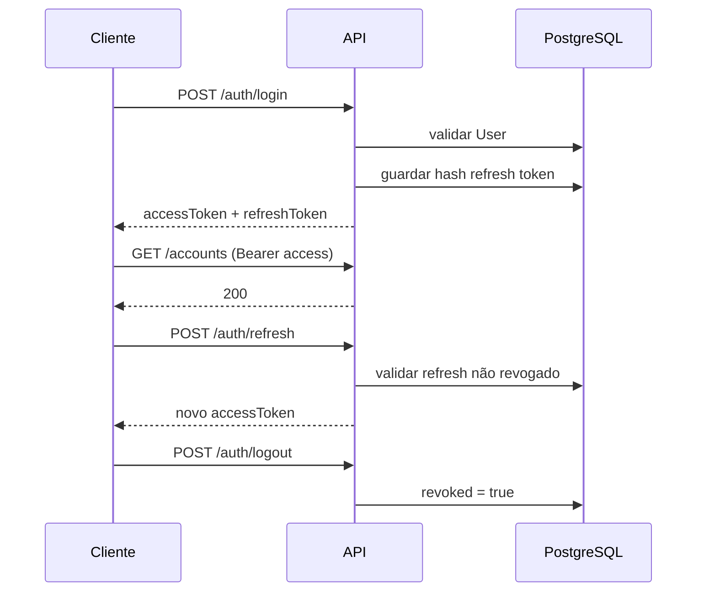

# Segurança e JWT

## Modelo

- **Stateless:** sem sessão HTTP server-side.
- **Access token:** curta duração (ex.: 24h) — enviado em cada request.
- **Refresh token:** longa duração (ex.: 7 dias) — persistido em `tb_refresh_tokens` (hash).

## Fluxo de tokens



## Configuração

```yaml
app:
  jwt:
    secret: ${JWT_SECRET}              # mín. 256 bits em produção
    expiration-ms: 86400000            # access: 24h
    refresh-expiration-ms: 604800000   # refresh: 7d
```

**Nunca** commitar `JWT_SECRET` real. Usar `.env` ou secrets do orchestrator.

## Componentes (infraestrutura)

| Classe | Responsabilidade |
|--------|------------------|
| `JwtTokenProvider` | Gerar e validar JWT (jjwt 0.12.x) |
| `JwtAuthenticationFilter` | Extrair Bearer, popular `SecurityContext` |
| `SecurityConfig` | Cadeia de filtros, rotas públicas, BCrypt |
| `CurrentUserService` | Obter `UUID userId` do contexto na application layer |

## Claims do access token (sugestão)

```json
{
  "sub": "<userId>",
  "email": "user@example.com",
  "iat": 1710000000,
  "exp": 1710086400
}
```

## Password

| Regra | Implementação |
|-------|---------------|
| Armazenamento | BCrypt (`BCryptPasswordEncoder`) |
| API | Nunca devolver `password` ou hash |
| Registo | Validar força mínima no DTO |

## Rotas e autorização

| Padrão | Acesso |
|--------|--------|
| `/auth/register`, `/auth/login`, `/auth/refresh` | `permitAll` |
| `/swagger-ui/**`, `/api-docs/**` | `permitAll` em dev; restringir em prod |
| `/actuator/health` | `permitAll` ou rede interna |
| `/actuator/**` (resto) | Autenticado ou IP interno |
| `/**` | `authenticated` |

## Isolamento multi-tenant (por utilizador)

```java
// Em todo Application Service
UUID userId = currentUserService.getUserId();
Account account = accountRepository.findByIdAndUserId(id, userId)
    .orElseThrow(() -> new NotFoundException("account", id));
```

**Nunca** usar `findById(id)` sem `userId` em recursos de utilizador.

## Refresh token — persistência

| Campo | Regra |
|-------|-------|
| `token_hash` | **SHA-256** do refresh token (ver [CONVENCOES.md](CONVENCOES.md)) |
| `expires_at` | Validar em cada refresh |
| `revoked` | `true` no logout; rejeitar refresh |

Rotação opcional: emitir novo refresh a cada `/auth/refresh` e revogar o anterior.

## Auditoria JPA

`AuditorAware<String>` retorna `currentUserService.getUserId().toString()` para `@CreatedBy` / `@LastModifiedBy`.

## User e Spring Security

O domínio `User` **não** deve depender de `UserDetails`. Opções:
- Adapter `UserDetailsService` na infra que carrega `UserJpaEntity` e mapeia para `UserDetails`.
- Ou entidade de segurança separada na infra.

## Checklist de segurança (produção)

- [ ] `JWT_SECRET` forte e rotacionável
- [ ] HTTPS obrigatório
- [ ] Actuator não exposto publicamente
- [ ] Rate limiting em `/auth/login` (fase 2)
- [ ] CORS restrito aos origins conhecidos
- [ ] Logs sem tokens nem passwords
