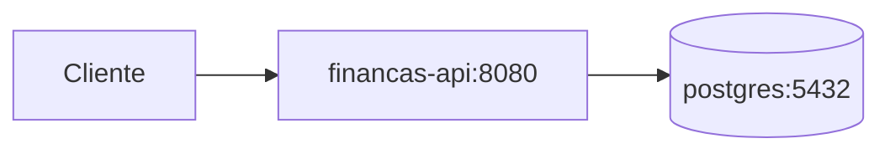

# Docker e deploy

## Arquitectura de containers (MVP)



## Estrutura de ficheiros

```
docker/
├── Dockerfile
└── docker-compose.yml
.env.example
```

## Dockerfile (multi-stage)

```dockerfile
# Stage 1: build
FROM eclipse-temurin:17-jdk-alpine AS build
WORKDIR /app
COPY mvnw pom.xml ./
COPY .mvn .mvn
COPY src src
RUN ./mvnw -q -DskipTests package

# Stage 2: runtime
FROM eclipse-temurin:17-jre-alpine
WORKDIR /app
COPY --from=build /app/target/*.jar app.jar
EXPOSE 8080
ENTRYPOINT ["java", "-jar", "app.jar"]
```

## docker-compose.yml

```yaml
services:
  postgres:
    image: postgres:16-alpine
    environment:
      POSTGRES_DB: financas_dev
      POSTGRES_USER: financas_user
      POSTGRES_PASSWORD: financas_pass
    ports:
      - "5432:5432"
    volumes:
      - pgdata:/var/lib/postgresql/data
    healthcheck:
      test: ["CMD-SHELL", "pg_isready -U financas_user -d financas_dev"]
      interval: 10s
      timeout: 5s
      retries: 5

  api:
    build:
      context: ..
      dockerfile: docker/Dockerfile
    ports:
      - "8080:8080"
    environment:
      SPRING_PROFILES_ACTIVE: docker
      SPRING_DATASOURCE_URL: jdbc:postgresql://postgres:5432/financas_dev
      SPRING_DATASOURCE_USERNAME: financas_user
      SPRING_DATASOURCE_PASSWORD: financas_pass
      JWT_SECRET: ${JWT_SECRET}
    depends_on:
      postgres:
        condition: service_healthy
    healthcheck:
      test: ["CMD", "wget", "-q", "--spider", "http://localhost:8080/actuator/health/liveness"]
      interval: 30s
      timeout: 10s
      retries: 3
      start_period: 60s

volumes:
  pgdata:
```

## application-docker.yml

```yaml
spring:
  datasource:
    url: ${SPRING_DATASOURCE_URL}
    username: ${SPRING_DATASOURCE_USERNAME}
    password: ${SPRING_DATASOURCE_PASSWORD}
  jpa:
    hibernate:
      ddl-auto: validate
  flyway:
    enabled: true

server:
  port: 8080
  servlet:
    context-path: /api/v1

management:
  server:
    add-application-context-path: false
  endpoints:
    web:
      base-path: /actuator
      exposure:
        include: health,info,metrics,caches

app:
  jwt:
    secret: ${JWT_SECRET}
    expiration-ms: 86400000
    refresh-expiration-ms: 604800000
```

Configuração alinhada com [CONVENCOES.md](CONVENCOES.md).

## Variáveis de ambiente

| Variável | Obrigatória | Descrição |
|----------|-------------|-----------|
| `JWT_SECRET` | Sim (prod) | Chave HMAC ≥ 256 bits |
| `SPRING_DATASOURCE_URL` | Sim | JDBC URL |
| `SPRING_DATASOURCE_USERNAME` | Sim | Utilizador BD |
| `SPRING_DATASOURCE_PASSWORD` | Sim | Password BD |
| `SPRING_PROFILES_ACTIVE` | Não | `docker`, `prod` |
| `MAIL_USERNAME` | Não | E-mail (fase 2) |
| `MAIL_PASSWORD` | Não | E-mail (fase 2) |

## .env.example

```env
JWT_SECRET=alterar-em-producao-chave-com-pelo-menos-32-caracteres-aleatorios
SPRING_DATASOURCE_URL=jdbc:postgresql://localhost:5432/financas_dev
SPRING_DATASOURCE_USERNAME=financas_user
SPRING_DATASOURCE_PASSWORD=financas_pass
```

## Comandos

```bash
# Subir stack
docker compose -f docker/docker-compose.yml --env-file .env up -d

# Logs da API
docker compose -f docker/docker-compose.yml logs -f api

# Parar
docker compose -f docker/docker-compose.yml down

# Parar e apagar volumes
docker compose -f docker/docker-compose.yml down -v
```

## Desenvolvimento local (sem Docker da API)

1. Subir apenas Postgres: `docker compose up postgres -d`
2. Correr API: `./mvnw spring-boot:run`
3. Swagger: `http://localhost:8080/api/v1/swagger-ui.html`

## Ordem de arranque

1. PostgreSQL healthy (`pg_isready`)
2. Flyway migra schema na primeira arrancada da API
3. API healthy (`/actuator/health/liveness`)

## Produção (notas)

- Usar secrets manager para `JWT_SECRET` e passwords.
- Não expor Postgres publicamente.
- HTTPS via reverse proxy (nginx, traefik).
- Profiles: `prod` com logging INFO, Actuator restrito.
- Backup automático do volume `pgdata`.

## Stack alinhada

| Componente | Versão |
|------------|--------|
| Java (runtime) | 17 |
| Spring Boot | 3.x |
| PostgreSQL | 16+ |
| Imagem base | `eclipse-temurin:17` |
